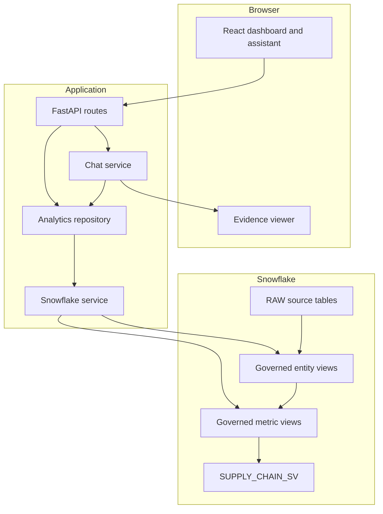
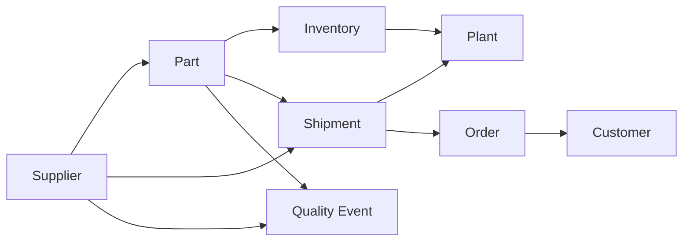

# SupplyGraph AI Architecture

## System Context

SupplyGraph AI provides one governed analytical surface for planning,
procurement, and logistics users. Persona selection changes the business
guidance in an answer, never the metric definition, SQL, or value.

## Canonical Ontology

The model is implemented by the scripts in `snowflake/`. Entity views provide
stable business concepts; metric views calculate canonical KPIs; the semantic
view exposes their relationships and dimensions for governed analytics.

## Request Flow

1. React calls a typed `/api` endpoint.
2. FastAPI validates parameters and persona values with Pydantic.
3. Snowflake Cortex classifies the question into a strict metric-and-period
    schema; deterministic matching is the availability fallback.
4. Pydantic rejects values outside the supported metric allowlist.
5. The repository selects SQL from an internal allow-listed catalog.
6. Snowflake executes the read-only query against governed objects.
7. The response includes interpretation provenance, metric evidence, and SQL.
8. React renders the answer, definition, formula, source, period, and rows.

## Governance Boundary

The browser never sends SQL. Cortex classifies intent but does not synthesize
or execute SQL. The chat service accepts only supported business intents and
resolves them to predefined queries and metric definitions. Unsupported or
destructive requests return `422` without reaching governed metric SQL.

Public data-access failures return a generic `503`; connector details and
credentials are not exposed. Runtime secrets are supplied only through
environment variables.

## Deployment

The production Docker image has two stages:

1. Node builds the Vite application.
2. Python installs FastAPI and copies the frontend output into `/app/static`.

FastAPI serves `/api/*` first and mounts the React build at `/`, providing one
deployable service and avoiding production CORS dependencies. `render.yaml`
defines the corresponding Render service and secret placeholders.

## Resilience

When FastAPI cannot return analytics, React displays a clearly labeled,
validated demo snapshot. It never presents fallback data as live Snowflake
output. React Query retries transient failures once, and evidence responses
remain deterministic across personas.
