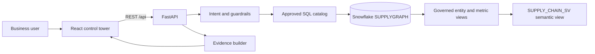

# SupplyGraph AI

SupplyGraph AI is a governed supply-chain intelligence copilot built for the
Snowflake CoCo CLI Hackathon 2026, GCC Edition. It combines a responsive
operations dashboard with evidence-backed conversational analytics over a
canonical Snowflake supply-chain model.

**Team:** NOVA-AgenticIQ  
**Team leader:** Nikhilraj SV  
**Team size:** 1

## Live Deployment

- Application: <https://supplygraph-ai-web.vercel.app>
- API health: <https://supplygraph-ai.vercel.app/api/health>
- Source: <https://github.com/nikhilrajsv054/supplygraph-ai>

## Why It Matters

Supply-chain teams often calculate the same metric differently across
planning, procurement, and logistics. SupplyGraph resolves every supported
question through approved metric definitions and governed Snowflake objects,
then returns the definition, formula, source, period, filters, SQL, and result
rows alongside the answer.

## Capabilities

- Dashboard for delivery, fulfillment, inventory risk, cost, and order impact
- Planning, procurement, and logistics personas with identical metric values
- Evidence panel with canonical definition, formula, source object, and SQL
- Snowflake Cortex intent interpretation with deterministic fallback
- Fixed governed-query catalog; chat cannot generate arbitrary SQL
- Visible demo-snapshot fallback when the live API is unavailable
- Responsive React interface and typed FastAPI contracts

## Architecture



See [ARCHITECTURE.md](ARCHITECTURE.md) for trust boundaries and data flow.

## Technology

- React 19, TypeScript, Vite, Material UI, React Query, Recharts
- Python, FastAPI, Pydantic Settings, Snowflake Connector, Snowflake Cortex AI
- Snowflake SQL, governed analytical views, formal semantic view
- Docker and Playwright

## Snowflake Setup

Run the scripts in order using Snowsight or SnowSQL with a role permitted to
create the included objects:

```text
snowflake/00_setup.sql
snowflake/01_tables.sql
snowflake/02_seed_data.sql
snowflake/03_transaction_data.sql
snowflake/04_governed_views.sql
snowflake/05_live_account_alignment.sql
snowflake/06_entity_views.sql
snowflake/07_semantic_view.sql
snowflake/08_runtime_role.sql
```

The default runtime expects:

```text
Database:  SUPPLYGRAPH
Schema:    GOVERNANCE
Warehouse: SUPPLYGRAPH_WH
Runtime role: SUPPLYGRAPH_APP
```

## Local Setup

Prerequisites: Node.js 22+, Python 3.9+, and access to the configured
Snowflake account.

```powershell
Copy-Item .env.example .env
```

Set `SNOWFLAKE_ACCOUNT`, `SNOWFLAKE_USER`, and `SNOWFLAKE_PASSWORD` in `.env`.
Set `CORTEX_ENABLED=true` to use the configured `CORTEX_MODEL`; invalid or
unavailable Cortex responses fall back to deterministic intent matching. Never
commit this file.

Backend:

```powershell
Set-Location backend
py -3.9 -m venv .venv
.\.venv\Scripts\python.exe -m pip install -r requirements.txt
.\.venv\Scripts\python.exe -m uvicorn app.main:app --port 8001
```

Frontend, in another terminal:

```powershell
Set-Location frontend
npm ci
npm run dev -- --host 127.0.0.1
```

Open `http://127.0.0.1:5173`. Port `8001` is used locally because Windows may
reserve port `8000`.

## Docker

Start Docker Desktop or Rancher Desktop, then run:

```powershell
docker compose up --build
```

Open `http://localhost:8080`. The production image builds React and serves it
from FastAPI, keeping UI and API on one origin.

## Validation

```powershell
Set-Location backend
.\.venv\Scripts\python.exe -m pytest -q

Set-Location ..\frontend
npm run lint
npm run build
npx playwright test tests/live-data.spec.ts --reporter=line --timeout=90000
```

Current validated result: 12 backend tests pass, frontend lint/build pass, and
the live browser integration test confirms all dashboard APIs return `200` and
the UI displays `Live governed data`.

## Demo Questions

1. What is on-time delivery this month?
2. What is our overall fill rate?
3. How many customer orders are affected?
4. What is our defect rate?
5. How much is total landed cost?
6. What are our days of inventory?
7. How reliably did vendors honor their commitments in the latest month?

## CoCo CLI Usage

CoCo CLI was used in the CoCo-enabled development workspace to iterate on the
Snowflake model, governed SQL, semantic-view design, application contracts,
and validation workflow. The SQL artifacts downloaded from that workspace are
preserved under `snowflake-downloaded/` and match the executable scripts under
`snowflake/`.

## Security

- `.env` is excluded from source control and Docker build context.
- Production uses the read-only `SUPPLYGRAPH_APP` role, not `ACCOUNTADMIN`.
- Snowflake errors are masked at the public API boundary.
- Cortex returns only an allow-listed metric and period; it never writes SQL.
- Chat maps the validated intent to fixed SQL; user text is never executed.
- The application performs read-only analytics and exposes no DDL/DML route.

## Submission

- [DEPLOYMENT_GUIDE.md](DEPLOYMENT_GUIDE.md)
- [PRESENTATION_NOTES.md](PRESENTATION_NOTES.md)
- [DEMO_SCRIPT.md](DEMO_SCRIPT.md)
- [SUBMISSION_CHECKLIST.md](SUBMISSION_CHECKLIST.md)
- Generated 10-slide deck: `submission-assets/SupplyGraph_AI_Submission_Deck.pptx`
- Official deck template: `Prototype Submission Template _ CoCo CLI Hackathon GCC Edition.pptx`
